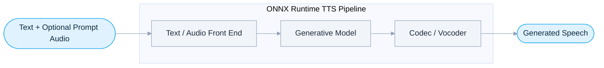

<div align="center">

# Text-to-Speech-TTS-ONNX

**Text-to-speech · voice cloning · voice design · vocoding with ONNX Runtime**

**语音合成 · 声音克隆 · 声音设计 · ONNX Runtime 声码器**

[](./LICENSE)
[](https://onnxruntime.ai)

</div>

---

Export and run TTS models with **ONNX Runtime** using text and optional prompt audio.

> 使用文本及可选提示音频，通过 **ONNX Runtime** 导出并运行 TTS 模型。



- **9 export targets / 9 个导出目标** across **7 model families / 7 个模型家族**, each with `Export`, `Inference`, and `Optimize` scripts.

---

## Supported Models · 支持的模型

| Capability · 能力 | Model · 模型 | Audio I/O · 音频输入输出 | Prompt audio · 提示音频 | Code · 代码 | Source · 来源 |
| --- | --- | :---: | :---: | --- | --- |
| Voice cloning<br>声音克隆 | F5-TTS | 24 → 24 kHz | Required<br>必需 | [`F5_TTS`](./F5_TTS) | [GitHub](https://github.com/SWivid/F5-TTS) |
| Voice cloning<br>声音克隆 | IndexTTS 1.5 | 24 → 24 kHz | Supported<br>支持 | [`Index_TTS/v1.5`](./Index_TTS/v1.5) | [GitHub](https://github.com/index-tts/index-tts) |
| Voice cloning · emotion control<br>声音克隆 · 情感控制 | IndexTTS 2 | 22.05 → 22.05 kHz | Supported<br>支持 | [`Index_TTS/v2`](./Index_TTS/v2) | [GitHub](https://github.com/index-tts/index-tts) |
| Text-to-speech<br>语音合成 | KaniTTS | Text → 22.05 kHz | No<br>否 | [`Kani_TTS`](./Kani_TTS) | [GitHub](https://github.com/nineninesix-ai/kani-tts) |
| Voice cloning · continuation<br>声音克隆 · 续写 | MOSS-TTS Nano | 48 → 48 kHz | Mode-dependent<br>取决于模式 | [`MOSS_TTS`](./MOSS_TTS) | [GitHub](https://github.com/OpenMOSS/MOSS-TTS) |
| Clone · custom voice · voice design<br>克隆 · 定制音色 · 声音设计 | Qwen3-TTS | 24 → 24 kHz | Mode-dependent<br>取决于模式 | [`Qwen_TTS`](./Qwen_TTS) | [GitHub](https://github.com/QwenLM/Qwen3-TTS) |
| Voice cloning<br>声音克隆 | VoxCPM 1.5 | 44.1 → 44.1 kHz | Supported<br>支持 | [`VoxCPM/v1.5`](./VoxCPM/v1.5) | [ModelScope](https://www.modelscope.cn/models/OpenBMB/VoxCPM1.5) |
| Clone · continuation · voice design<br>克隆 · 续写 · 声音设计 | VoxCPM 2 | 16 → 48 kHz | Mode-dependent<br>取决于模式 | [`VoxCPM/v2`](./VoxCPM/v2) | [ModelScope](https://www.modelscope.cn/models/OpenBMB/VoxCPM2) |
| Neural vocoder<br>神经声码器 | BigVGAN V2 | Mel → 24 kHz | No<br>否 | [`BigVGAN`](./BigVGAN) | [GitHub](https://github.com/NVIDIA/BigVGAN) |

> Rates are public ONNX I/O defaults; exporters handle native-rate conversion. `Mode-dependent` inputs are configured in the inference script. · 采样率为公开 ONNX 输入输出默认值；导出脚本负责原生采样率转换，模式相关输入在推理脚本中配置。

---

## Performance · 性能

**RTF** = synthesis time ÷ audio duration; lower is better. Unless noted, tests use a 6-second reference and generate about 15 words. Results vary by hardware and settings.<br>**RTF** = 合成耗时 ÷ 音频时长，越低越好。除特别注明外，测试使用 6 秒参考音频并生成约 15 个单词；结果取决于硬件与配置。

| OS · 系统 | Device · 设备 | Backend · 后端 | Model · 模型 | Precision · 精度 | Time · 耗时 (s) | RTF |
| --- | --- | --- | --- | :---: | :---: | :---: |
| Ubuntu 24.04 | Laptop · i7-1165G7 | CPU | F5-TTS · NFE=32 | f32 | 180 | 60 |
| Ubuntu 24.04 | Laptop · MX150 | GPU | F5-TTS · NFE=32 | f32 | 62 | 21 |
| Ubuntu 24.04 | Laptop · i7-1165G7 | CPU | IndexTTS | f32 | 18 | 6 |
| Ubuntu 24.04 | Laptop · MX150 | GPU | BigVGAN V2 24khz_100band_256x † | f16 | 4.6 | 1.53 |
| Ubuntu 24.04 | Laptop · i7-1165G7 | CPU | KaniTTS | q8f32 | 8.4 | 1.4 |
| Ubuntu 24.04 | Laptop · i7-1165G7 | CPU | KaniTTS | q4f32 | 5.2 | 0.87 |
| Ubuntu 24.04 | Desktop · i3-12300 | CPU | VoxCPM 1.5 | q8f32 | 9 | 1.5 |
| Ubuntu 24.04 | Desktop · RTX 5060 Ti | GPU | VoxCPM 1.5 | f16 | 1.03 | 0.17 |
| Ubuntu 24.04 | Desktop · i3-12300 | CPU | Qwen3-TTS-0.6B-Base | q8f32 | 19 | 3.1 |
| Ubuntu 24.04 | Desktop · i3-12300 | CPU | VoxCPM 2 | q8f32 | 23 | 3.8 |
| Ubuntu 24.04 | Desktop · RTX 5060 Ti | GPU | VoxCPM 2 | f16 | 2.05 | 0.34 |

> † BigVGAN uses a `(1, 100, 512)` mel input. · BigVGAN 使用 `(1, 100, 512)` mel 输入。

---

## Audio Contract · 音频约定

- Set public audio I/O with `IN_SAMPLE_RATE`, `OUT_SAMPLE_RATE`, `IN_AUDIO_DTYPE`, and `OUT_AUDIO_DTYPE` in each exporter; KaniTTS and BigVGAN expose output settings only.<br>在导出脚本中设置公开音频输入输出；KaniTTS 与 BigVGAN 仅提供输出设置。
- Audio tensors support `F16`, `F32`, and `INT16`; floating point uses `[-1, 1]`, while `INT16` uses PCM amplitude.<br>音频张量支持 `F16`、`F32` 与 `INT16`；浮点使用 `[-1, 1]`，`INT16` 使用 PCM 幅值。
- Resampling runs inside the ONNX graph with `torch.nn.functional.interpolate`.<br>重采样通过 `torch.nn.functional.interpolate` 在 ONNX 图内完成。
- `Metadata.onnx` stores the fixed package contract; runtime controls remain in the inference script. Inference validates metadata, graph layout, and referenced files.<br>`Metadata.onnx` 保存固定模型包契约；运行时配置保留在推理脚本中。推理时会校验元数据、图布局与引用文件。
- Streaming exporters require each codec or latent frame to map to a whole number of output samples.<br>流式导出要求每个 Codec 或 latent 帧对应整数个输出采样点。

---

## KaniTTS Decode Strategies · KaniTTS 解码策略

KaniTTS exports separate `greedy`, `penalty_greedy`, and `sampling` graphs. Set `DECODE_STRATEGY` in `Kani_TTS/Inference_Kani_TTS_ONNX.py`; the CLI selects the ONNX folder.<br>KaniTTS 会分别导出三种解码图；在推理脚本中设置 `DECODE_STRATEGY`，命令行指定 ONNX 文件夹。

```bash
cd Kani_TTS
python Export_Kani_TTS.py
python Optimize_ONNX.py
python Inference_Kani_TTS_ONNX.py --onnx-folder KaniTTS_Optimized
```

> Export runs one test inference automatically. · 导出后会自动执行一次测试推理。

---

<div align="center">
<sub><b>Text-to-Speech-TTS-ONNX</b> · Built with ONNX Runtime · <a href="https://github.com/DakeQQ?tab=repositories">More projects by DakeQQ / 更多项目</a></sub>
</div>